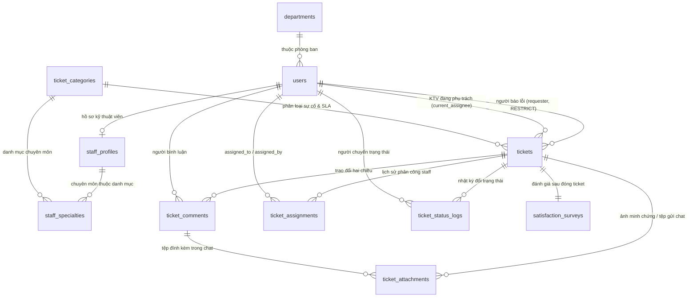

# 🗄️ THIẾT KẾ CƠ SỞ DỮ LIỆU MYSQL (DATABASE DATA MODEL)

Tài liệu này chi tiết hóa cấu trúc lưu trữ cơ sở dữ liệu quan hệ **MySQL / MariaDB** cho hệ thống **Helpdesk CNTT & Cơ sở vật chất (TLU)**. Kiến trúc được thiết kế tối ưu theo **Chuẩn hóa 3NF (Third Normal Form)**, đảm bảo tính toàn vẹn dữ liệu, hiệu năng truy vấn cao, hỗ trợ đầy đủ các ràng buộc khóa ngoại (Foreign Keys), chỉ mục (Indexes), Trigger tự động hóa và đáp ứng trọn vẹn các yêu cầu nghiệp vụ thực tế.

---

## 1. Sơ đồ Quan hệ Thực thể (ERD Schema Overview)



---

## 2. Chi tiết Đặc tả Các Bảng CSDL (Table Specifications — 11 Tables)

### 2.1. Bảng `departments` — Cơ cấu Tổ chức & Phòng ban
Chứa danh sách các Khoa, Phòng ban, Trung tâm trong toàn trường Đại học Thủy Lợi.

| Thuộc tính | Kiểu dữ liệu | Ràng buộc | Mô tả & Giải thích |
| :--- | :--- | :--- | :--- |
| `id` | `BIGINT` | `UNSIGNED, AUTO_INCREMENT, Primary Key` | ID phòng ban (Khóa chính) |
| `code` | `VARCHAR(20)` | `UNIQUE, NOT NULL` | Mã phòng ban (VD: CNTT, QT3B, DT) |
| `name` | `VARCHAR(100)` | `NOT NULL` | Tên phòng ban / đơn vị |
| `created_at` | `TIMESTAMP` | `NOT NULL, DEFAULT CURRENT_TIMESTAMP` | Thời điểm tạo bản ghi |
| `updated_at` | `TIMESTAMP` | `NOT NULL, DEFAULT CURRENT_TIMESTAMP ON UPDATE` | Thời điểm cập nhật bản ghi |

### 2.2. Bảng `users` — Tài khoản Người dùng & Phân quyền
Lưu trữ toàn bộ thông tin tài khoản đăng nhập của Sinh viên, Giảng viên, Kỹ thuật viên và Quản trị viên.

| Thuộc tính | Kiểu dữ liệu | Ràng buộc | Mô tả & Giải thích |
| :--- | :--- | :--- | :--- |
| `id` | `BIGINT` | `UNSIGNED, AUTO_INCREMENT, Primary Key` | ID người dùng (Khóa chính) |
| `department_id` | `BIGINT` | `UNSIGNED, NULLABLE, Foreign Key` | Trực thuộc phòng ban nào (FK -> departments.id, ON DELETE SET NULL) |
| `name` | `VARCHAR(100)` | `NOT NULL` | Họ và tên đầy đủ |
| `email` | `VARCHAR(100)` | `UNIQUE, NOT NULL` | Email TLU (`@st.tlu.edu.vn` hoặc `@tlu.edu.vn`) |
| `password` | `VARCHAR(255)` | `NOT NULL` | Mật khẩu đã mã hóa (Bcrypt Hash) |
| `role` | `ENUM` | `'REQUESTER', 'STAFF', 'MANAGER'` | Vai trò hệ thống: Người gửi / Kỹ thuật / Quản lý |
| `is_active` | `BOOLEAN` | `NOT NULL, DEFAULT TRUE` | Trạng thái tài khoản (True: Hoạt động, False: Khóa) |
| `email_verified_at`| `TIMESTAMP` | `NULLABLE` | Thời điểm xác thực email TLU |
| `created_at` | `TIMESTAMP` | `NOT NULL, DEFAULT CURRENT_TIMESTAMP` | Thời điểm tạo tài khoản |
| `updated_at` | `TIMESTAMP` | `NOT NULL, DEFAULT CURRENT_TIMESTAMP ON UPDATE` | Thời điểm cập nhật |

### 2.3. Bảng `staff_profiles` — Hồ sơ Kỹ thuật viên
Lưu thông tin nghiệp vụ mở rộng cho cán bộ kỹ thuật (Quan hệ 1-1 với `users`).

| Thuộc tính | Kiểu dữ liệu | Ràng buộc | Mô tả & Giải thích |
| :--- | :--- | :--- | :--- |
| `id` | `BIGINT` | `UNSIGNED, AUTO_INCREMENT, Primary Key` | ID hồ sơ (Khóa chính) |
| `user_id` | `BIGINT` | `UNSIGNED, UNIQUE, NOT NULL, Foreign Key` | Liên kết tài khoản (FK -> users.id, ON DELETE CASCADE) |
| `phone` | `VARCHAR(20)` | `NULLABLE` | Số điện thoại trực ca |
| `shift` | `VARCHAR(50)` | `NULLABLE` | Ca trực cố định (Sáng / Chiều / Tối) |
| `created_at` | `TIMESTAMP` | `NOT NULL, DEFAULT CURRENT_TIMESTAMP` | Thời điểm tạo |
| `updated_at` | `TIMESTAMP` | `NOT NULL, DEFAULT CURRENT_TIMESTAMP ON UPDATE` | Thời điểm cập nhật |

### 2.4. Bảng `staff_specialties` — Chuyên môn Kỹ thuật viên (Bảng phụ N-N)
Liên kết danh mục chuyên môn của Kỹ thuật viên với danh mục sự cố `ticket_categories` để hệ thống tự động gợi ý phân công.

| Thuộc tính | Kiểu dữ liệu | Ràng buộc | Mô tả & Giải thích |
| :--- | :--- | :--- | :--- |
| `staff_profile_id`| `BIGINT` | `UNSIGNED, NOT NULL, Foreign Key` | Thuộc hồ sơ staff nào (FK -> staff_profiles.id, ON DELETE CASCADE) |
| `category_id` | `BIGINT` | `UNSIGNED, NOT NULL, Foreign Key` | Phụ trách loại sự cố nào (FK -> ticket_categories.id, ON DELETE CASCADE) |
| `PRIMARY KEY` | `(staff_profile_id, category_id)` | `Composite Key` | Khóa chính phức hợp |

### 2.5. Bảng `ticket_categories` — Danh mục Sự cố & Cấu hình SLA
Danh mục loại lỗi kỹ thuật và thời gian cam kết khắc phục sự cố (SLA).

| Thuộc tính | Kiểu dữ liệu | Ràng buộc | Mô tả & Giải thích |
| :--- | :--- | :--- | :--- |
| `id` | `BIGINT` | `UNSIGNED, AUTO_INCREMENT, Primary Key` | ID danh mục (Khóa chính) |
| `name` | `VARCHAR(100)` | `UNIQUE, NOT NULL` | Tên loại sự cố (Lỗi Wi-Fi, Máy chiếu, Lỗi Kênh ĐKMH) |
| `description` | `TEXT` | `NULLABLE` | Mô tả chi tiết phạm vi sự cố |
| `sla_hours` | `INT` | `UNSIGNED, NOT NULL, DEFAULT 24` | Thời gian xử lý tối đa cam kết (Tính theo giờ) |
| `created_at` | `TIMESTAMP` | `NOT NULL, DEFAULT CURRENT_TIMESTAMP` | Thời điểm tạo |
| `updated_at` | `TIMESTAMP` | `NOT NULL, DEFAULT CURRENT_TIMESTAMP ON UPDATE` | Thời điểm cập nhật |

### 2.6. Bảng `tickets` — Phiếu Phản ánh Sự cố (Central Table)
Bảng trung tâm chứa thông tin yêu cầu hỗ trợ sự cố từ Sinh viên/Giảng viên.

| Thuộc tính | Kiểu dữ liệu | Ràng buộc | Mô tả & Giải thích |
| :--- | :--- | :--- | :--- |
| `id` | `BIGINT` | `UNSIGNED, AUTO_INCREMENT, Primary Key` | ID phiếu sự cố (Khóa chính) |
| `title` | `VARCHAR(255)` | `NOT NULL` | Tiêu đề ngắn gọn mô tả sự cố |
| `description` | `TEXT` | `NOT NULL` | Mô tả chi tiết hiện trạng lỗi |
| `location` | `VARCHAR(150)` | `NULLABLE` | Vị trí vật lý sự cố (VD: Phòng 302 - Nhà C5) |
| `category_id` | `BIGINT` | `UNSIGNED, NOT NULL, Foreign Key` | Thuộc loại sự cố nào (FK -> ticket_categories.id, RESTRICT) |
| `requester_id` | `BIGINT` | `UNSIGNED, NOT NULL, Foreign Key` | Người báo lỗi (FK -> users.id, ON DELETE RESTRICT) |
| `current_assignee_id` | `BIGINT` | `UNSIGNED, NULLABLE, Foreign Key` | KTV đang phụ trách (FK -> users.id, ON DELETE SET NULL) |
| `status` | `ENUM` | `'OPEN', 'IN_PROGRESS', 'RESOLVED', 'CLOSED', 'REOPENED'` | Trạng thái ticket |
| `priority` | `ENUM` | `'LOW', 'MEDIUM', 'HIGH'` | Mức độ ưu tiên khắc phục |
| `sla_deadline` | `TIMESTAMP` | `NULLABLE` | Mốc thời gian hết hạn SLA (`created_at + sla_hours`) |
| `resolved_at` | `TIMESTAMP` | `NULLABLE` | Thời điểm chuyển sang trạng thái RESOLVED |
| `closed_at` | `TIMESTAMP` | `NULLABLE` | Thời điểm đóng ticket hoàn toàn (CLOSED) |
| `created_at` | `TIMESTAMP` | `NOT NULL, DEFAULT CURRENT_TIMESTAMP` | Thời điểm khởi tạo ticket |
| `updated_at` | `TIMESTAMP` | `NOT NULL, DEFAULT CURRENT_TIMESTAMP ON UPDATE` | Thời điểm cập nhật gần nhất |

### 2.7. Bảng `ticket_attachments` — Tệp & Hình ảnh Minh chứng
Lưu trữ danh sách ảnh minh chứng ban đầu của Ticket HOẶC tệp gửi đính kèm trong khung Chat.

| Thuộc tính | Kiểu dữ liệu | Ràng buộc | Mô tả & Giải thích |
| :--- | :--- | :--- | :--- |
| `id` | `BIGINT` | `UNSIGNED, AUTO_INCREMENT, Primary Key` | ID file đính kèm (Khóa chính) |
| `ticket_id` | `BIGINT` | `UNSIGNED, NOT NULL, Foreign Key` | Thuộc ticket nào (FK -> tickets.id, ON DELETE CASCADE) |
| `comment_id` | `BIGINT` | `UNSIGNED, NULLABLE, Foreign Key` | Thuộc câu chat nào (FK -> ticket_comments.id, ON DELETE CASCADE). `NULL` = Ảnh gốc |
| `file_path` | `VARCHAR(255)` | `NOT NULL` | Đường dẫn lưu trữ ảnh/file trên Server |
| `file_type` | `VARCHAR(50)` | `NULLABLE` | Định dạng file (image/jpeg, image/png, application/pdf) |
| `created_at` | `TIMESTAMP` | `NOT NULL, DEFAULT CURRENT_TIMESTAMP` | Thời điểm tải file lên |

### 2.8. Bảng `ticket_assignments` — Lịch sử Phân công Kỹ thuật viên
Lưu vết lịch sử giao việc hoặc đổi Kỹ thuật viên phụ trách Ticket.

| Thuộc tính | Kiểu dữ liệu | Ràng buộc | Mô tả & Giải thích |
| :--- | :--- | :--- | :--- |
| `id` | `BIGINT` | `UNSIGNED, AUTO_INCREMENT, Primary Key` | ID lượt phân công (Khóa chính) |
| `ticket_id` | `BIGINT` | `UNSIGNED, NOT NULL, Foreign Key` | Phân công cho ticket nào (FK -> tickets.id, ON DELETE CASCADE) |
| `assigned_to_staff_id` | `BIGINT` | `UNSIGNED, NOT NULL, Foreign Key` | Kỹ thuật viên nhận nhiệm vụ (FK -> users.id, ON DELETE RESTRICT) |
| `assigned_by_user_id` | `BIGINT` | `UNSIGNED, NOT NULL, Foreign Key` | Người thực hiện giao việc (FK -> users.id, ON DELETE RESTRICT) |
| `note` | `TEXT` | `NULLABLE` | Ghi chú / Chỉ đạo chuyên môn khi giao việc |
| `assigned_at` | `TIMESTAMP` | `NOT NULL, DEFAULT CURRENT_TIMESTAMP` | Thời điểm thực hiện phân công |

### 2.9. Bảng `ticket_comments` — Trao đổi Hai chiều
Bình luận, trao đổi thông tin qua lại giữa Người báo lỗi và Kỹ thuật viên xử lý.

| Thuộc tính | Kiểu dữ liệu | Ràng buộc | Mô tả & Giải thích |
| :--- | :--- | :--- | :--- |
| `id` | `BIGINT` | `UNSIGNED, AUTO_INCREMENT, Primary Key` | ID bình luận (Khóa chính) |
| `ticket_id` | `BIGINT` | `UNSIGNED, NOT NULL, Foreign Key` | Thuộc ticket nào (FK -> tickets.id, ON DELETE CASCADE) |
| `user_id` | `BIGINT` | `UNSIGNED, NOT NULL, Foreign Key` | Người viết bình luận (FK -> users.id, ON DELETE RESTRICT) |
| `content` | `TEXT` | `NOT NULL` | Nội dung câu trao đổi |
| `created_at` | `TIMESTAMP` | `NOT NULL, DEFAULT CURRENT_TIMESTAMP` | Thời điểm gửi bình luận |

### 2.10. Bảng `ticket_status_logs` — Nhật ký Chuyển Trạng thái (Append-Only Log)
Lưu vết lịch sử thay đổi tiến độ của Ticket. Bảng này bất biến (chỉ INSERT, cấm UPDATE/DELETE).

| Thuộc tính | Kiểu dữ liệu | Ràng buộc | Mô tả & Giải thích |
| :--- | :--- | :--- | :--- |
| `id` | `BIGINT` | `UNSIGNED, AUTO_INCREMENT, Primary Key` | ID log (Khóa chính) |
| `ticket_id` | `BIGINT` | `UNSIGNED, NOT NULL, Foreign Key` | Thuộc ticket nào (FK -> tickets.id, ON DELETE CASCADE) |
| `changed_by_user_id` | `BIGINT` | `UNSIGNED, NOT NULL, Foreign Key` | Người bấm chuyển trạng thái (FK -> users.id, ON DELETE RESTRICT) |
| `old_status` | `ENUM` | `'OPEN', 'IN_PROGRESS', 'RESOLVED', 'CLOSED', 'REOPENED', NULLABLE` | Trạng thái trước khi chuyển |
| `new_status` | `ENUM` | `'OPEN', 'IN_PROGRESS', 'RESOLVED', 'CLOSED', 'REOPENED'` | Trạng thái mới chuyển sang |
| `created_at` | `TIMESTAMP` | `NOT NULL, DEFAULT CURRENT_TIMESTAMP` | Thời điểm ghi nhận thao tác |

### 2.11. Bảng `satisfaction_surveys` — Khảo sát Đánh giá Mức độ Hài lòng
Bài đánh giá chất lượng phục vụ sau khi Ticket đã hoàn thành xử lý.

| Thuộc tính | Kiểu dữ liệu | Ràng buộc | Mô tả & Giải thích |
| :--- | :--- | :--- | :--- |
| `id` | `BIGINT` | `UNSIGNED, AUTO_INCREMENT, Primary Key` | ID bài đánh giá (Khóa chính) |
| `ticket_id` | `BIGINT` | `UNSIGNED, UNIQUE, NOT NULL, Foreign Key` | Khóa ngoại duy nhất (FK -> tickets.id, ON DELETE CASCADE) |
| `rating_stars` | `TINYINT UNSIGNED` | `NOT NULL, CHECK (rating_stars BETWEEN 1 AND 5)` | Mức điểm chấm: 1 đến 5 sao |
| `comment` | `TEXT` | `NULLABLE` | Ý kiến nhận xét đóng góp |
| `created_at` | `TIMESTAMP` | `NOT NULL, DEFAULT CURRENT_TIMESTAMP` | Thời điểm gửi đánh giá |

---

## 3. Câu lệnh SQL Tạo Bảng & Ràng buộc Chi tiết (Complete Production DDL Script)

> 📌 **Yêu cầu hệ thống**: **MySQL 8.0.16+** hoặc **MariaDB 10.2.1+** để các ràng buộc `CHECK CONSTRAINT` hoạt động thực tế.

```sql
-- 1. Bảng Phòng ban (departments)
CREATE TABLE `departments` (
  `id` BIGINT UNSIGNED AUTO_INCREMENT PRIMARY KEY,
  `code` VARCHAR(20) NOT NULL UNIQUE,
  `name` VARCHAR(100) NOT NULL,
  `created_at` TIMESTAMP NOT NULL DEFAULT CURRENT_TIMESTAMP,
  `updated_at` TIMESTAMP NOT NULL DEFAULT CURRENT_TIMESTAMP ON UPDATE CURRENT_TIMESTAMP
) ENGINE=InnoDB DEFAULT CHARSET=utf8mb4 COLLATE=utf8mb4_unicode_ci;

-- 2. Bảng Người dùng (users)
CREATE TABLE `users` (
  `id` BIGINT UNSIGNED AUTO_INCREMENT PRIMARY KEY,
  `department_id` BIGINT UNSIGNED NULL,
  `name` VARCHAR(100) NOT NULL,
  `email` VARCHAR(100) NOT NULL UNIQUE,
  `password` VARCHAR(255) NOT NULL,
  `role` ENUM('REQUESTER', 'STAFF', 'MANAGER') NOT NULL DEFAULT 'REQUESTER',
  `is_active` TINYINT(1) NOT NULL DEFAULT 1,
  `email_verified_at` TIMESTAMP NULL DEFAULT NULL,
  `created_at` TIMESTAMP NOT NULL DEFAULT CURRENT_TIMESTAMP,
  `updated_at` TIMESTAMP NOT NULL DEFAULT CURRENT_TIMESTAMP ON UPDATE CURRENT_TIMESTAMP,
  CONSTRAINT `fk_users_department` FOREIGN KEY (`department_id`) REFERENCES `departments`(`id`) ON DELETE SET NULL
) ENGINE=InnoDB DEFAULT CHARSET=utf8mb4 COLLATE=utf8mb4_unicode_ci;

-- 3. Bảng Hồ sơ Kỹ thuật viên (staff_profiles)
CREATE TABLE `staff_profiles` (
  `id` BIGINT UNSIGNED AUTO_INCREMENT PRIMARY KEY,
  `user_id` BIGINT UNSIGNED NOT NULL UNIQUE,
  `phone` VARCHAR(20) NULL,
  `shift` VARCHAR(50) NULL,
  `created_at` TIMESTAMP NOT NULL DEFAULT CURRENT_TIMESTAMP,
  `updated_at` TIMESTAMP NOT NULL DEFAULT CURRENT_TIMESTAMP ON UPDATE CURRENT_TIMESTAMP,
  CONSTRAINT `fk_staff_user` FOREIGN KEY (`user_id`) REFERENCES `users`(`id`) ON DELETE CASCADE
) ENGINE=InnoDB DEFAULT CHARSET=utf8mb4 COLLATE=utf8mb4_unicode_ci;

-- 4. Bảng Danh mục Sự cố (ticket_categories)
CREATE TABLE `ticket_categories` (
  `id` BIGINT UNSIGNED AUTO_INCREMENT PRIMARY KEY,
  `name` VARCHAR(100) NOT NULL UNIQUE,
  `description` TEXT NULL,
  `sla_hours` INT UNSIGNED NOT NULL DEFAULT 24,
  `created_at` TIMESTAMP NOT NULL DEFAULT CURRENT_TIMESTAMP,
  `updated_at` TIMESTAMP NOT NULL DEFAULT CURRENT_TIMESTAMP ON UPDATE CURRENT_TIMESTAMP
) ENGINE=InnoDB DEFAULT CHARSET=utf8mb4 COLLATE=utf8mb4_unicode_ci;

-- 5. Bảng Chuyên môn Staff (staff_specialties - N-N)
CREATE TABLE `staff_specialties` (
  `staff_profile_id` BIGINT UNSIGNED NOT NULL,
  `category_id` BIGINT UNSIGNED NOT NULL,
  PRIMARY KEY (`staff_profile_id`, `category_id`),
  CONSTRAINT `fk_specialty_staff` FOREIGN KEY (`staff_profile_id`) REFERENCES `staff_profiles`(`id`) ON DELETE CASCADE,
  CONSTRAINT `fk_specialty_category` FOREIGN KEY (`category_id`) REFERENCES `ticket_categories`(`id`) ON DELETE CASCADE
) ENGINE=InnoDB DEFAULT CHARSET=utf8mb4 COLLATE=utf8mb4_unicode_ci;

-- 6. Bảng Trung tâm Phiếu sự cố (tickets)
CREATE TABLE `tickets` (
  `id` BIGINT UNSIGNED AUTO_INCREMENT PRIMARY KEY,
  `title` VARCHAR(255) NOT NULL,
  `description` TEXT NOT NULL,
  `location` VARCHAR(150) NULL,
  `category_id` BIGINT UNSIGNED NOT NULL,
  `requester_id` BIGINT UNSIGNED NOT NULL,
  `current_assignee_id` BIGINT UNSIGNED NULL,
  `status` ENUM('OPEN', 'IN_PROGRESS', 'RESOLVED', 'CLOSED', 'REOPENED') NOT NULL DEFAULT 'OPEN',
  `priority` ENUM('LOW', 'MEDIUM', 'HIGH') NOT NULL DEFAULT 'MEDIUM',
  `sla_deadline` TIMESTAMP NULL DEFAULT NULL,
  `resolved_at` TIMESTAMP NULL DEFAULT NULL,
  `closed_at` TIMESTAMP NULL DEFAULT NULL,
  `created_at` TIMESTAMP NOT NULL DEFAULT CURRENT_TIMESTAMP,
  `updated_at` TIMESTAMP NOT NULL DEFAULT CURRENT_TIMESTAMP ON UPDATE CURRENT_TIMESTAMP,
  
  -- Foreign Keys
  CONSTRAINT `fk_tickets_category` FOREIGN KEY (`category_id`) REFERENCES `ticket_categories`(`id`) ON DELETE RESTRICT,
  CONSTRAINT `fk_tickets_requester` FOREIGN KEY (`requester_id`) REFERENCES `users`(`id`) ON DELETE RESTRICT,
  CONSTRAINT `fk_tickets_assignee` FOREIGN KEY (`current_assignee_id`) REFERENCES `users`(`id`) ON DELETE SET NULL,
  
  -- Performance Single & Composite Indexes
  INDEX `idx_tickets_status` (`status`),
  INDEX `idx_tickets_priority` (`priority`),
  INDEX `idx_tickets_sla_deadline` (`sla_deadline`),
  INDEX `idx_tickets_requester` (`requester_id`),
  INDEX `idx_tickets_assignee` (`current_assignee_id`),
  INDEX `idx_tickets_assignee_priority_sla` (`current_assignee_id`, `priority`, `sla_deadline`)
) ENGINE=InnoDB DEFAULT CHARSET=utf8mb4 COLLATE=utf8mb4_unicode_ci;

-- 7. Bảng Nội dung Trao đổi Hai chiều (ticket_comments)
CREATE TABLE `ticket_comments` (
  `id` BIGINT UNSIGNED AUTO_INCREMENT PRIMARY KEY,
  `ticket_id` BIGINT UNSIGNED NOT NULL,
  `user_id` BIGINT UNSIGNED NOT NULL,
  `content` TEXT NOT NULL,
  `created_at` TIMESTAMP NOT NULL DEFAULT CURRENT_TIMESTAMP,
  CONSTRAINT `fk_comments_ticket` FOREIGN KEY (`ticket_id`) REFERENCES `tickets`(`id`) ON DELETE CASCADE,
  CONSTRAINT `fk_comments_user` FOREIGN KEY (`user_id`) REFERENCES `users`(`id`) ON DELETE RESTRICT,
  INDEX `idx_comments_ticket` (`ticket_id`)
) ENGINE=InnoDB DEFAULT CHARSET=utf8mb4 COLLATE=utf8mb4_unicode_ci;

-- 8. Bảng Tệp & Hình ảnh Minh chứng (ticket_attachments)
CREATE TABLE `ticket_attachments` (
  `id` BIGINT UNSIGNED AUTO_INCREMENT PRIMARY KEY,
  `ticket_id` BIGINT UNSIGNED NOT NULL,
  `comment_id` BIGINT UNSIGNED NULL,
  `file_path` VARCHAR(255) NOT NULL,
  `file_type` VARCHAR(50) NULL,
  `created_at` TIMESTAMP NOT NULL DEFAULT CURRENT_TIMESTAMP,
  CONSTRAINT `fk_attachments_ticket` FOREIGN KEY (`ticket_id`) REFERENCES `tickets`(`id`) ON DELETE CASCADE,
  CONSTRAINT `fk_attachments_comment` FOREIGN KEY (`comment_id`) REFERENCES `ticket_comments`(`id`) ON DELETE CASCADE
) ENGINE=InnoDB DEFAULT CHARSET=utf8mb4 COLLATE=utf8mb4_unicode_ci;

-- 9. Bảng Lịch sử Phân công Kỹ thuật viên (ticket_assignments)
CREATE TABLE `ticket_assignments` (
  `id` BIGINT UNSIGNED AUTO_INCREMENT PRIMARY KEY,
  `ticket_id` BIGINT UNSIGNED NOT NULL,
  `assigned_to_staff_id` BIGINT UNSIGNED NOT NULL,
  `assigned_by_user_id` BIGINT UNSIGNED NOT NULL,
  `note` TEXT NULL,
  `assigned_at` TIMESTAMP NOT NULL DEFAULT CURRENT_TIMESTAMP,
  CONSTRAINT `fk_assignments_ticket` FOREIGN KEY (`ticket_id`) REFERENCES `tickets`(`id`) ON DELETE CASCADE,
  CONSTRAINT `fk_assignments_to_staff` FOREIGN KEY (`assigned_to_staff_id`) REFERENCES `users`(`id`) ON DELETE RESTRICT,
  CONSTRAINT `fk_assignments_by_user` FOREIGN KEY (`assigned_by_user_id`) REFERENCES `users`(`id`) ON DELETE RESTRICT,
  INDEX `idx_assignments_staff` (`assigned_to_staff_id`, `assigned_at`)
) ENGINE=InnoDB DEFAULT CHARSET=utf8mb4 COLLATE=utf8mb4_unicode_ci;

-- 10. Bảng Nhật ký Chuyển Trạng thái (ticket_status_logs)
CREATE TABLE `ticket_status_logs` (
  `id` BIGINT UNSIGNED AUTO_INCREMENT PRIMARY KEY,
  `ticket_id` BIGINT UNSIGNED NOT NULL,
  `changed_by_user_id` BIGINT UNSIGNED NOT NULL,
  `old_status` ENUM('OPEN', 'IN_PROGRESS', 'RESOLVED', 'CLOSED', 'REOPENED') NULL,
  `new_status` ENUM('OPEN', 'IN_PROGRESS', 'RESOLVED', 'CLOSED', 'REOPENED') NOT NULL,
  `created_at` TIMESTAMP NOT NULL DEFAULT CURRENT_TIMESTAMP,
  CONSTRAINT `fk_status_logs_ticket` FOREIGN KEY (`ticket_id`) REFERENCES `tickets`(`id`) ON DELETE CASCADE,
  CONSTRAINT `fk_status_logs_user` FOREIGN KEY (`changed_by_user_id`) REFERENCES `users`(`id`) ON DELETE RESTRICT,
  INDEX `idx_logs_ticket` (`ticket_id`)
) ENGINE=InnoDB DEFAULT CHARSET=utf8mb4 COLLATE=utf8mb4_unicode_ci;

-- 11. Bảng Đánh giá Mức độ Hài lòng (satisfaction_surveys)
CREATE TABLE `satisfaction_surveys` (
  `id` BIGINT UNSIGNED AUTO_INCREMENT PRIMARY KEY,
  `ticket_id` BIGINT UNSIGNED NOT NULL UNIQUE,
  `rating_stars` TINYINT UNSIGNED NOT NULL,
  `comment` TEXT NULL,
  `created_at` TIMESTAMP NOT NULL DEFAULT CURRENT_TIMESTAMP,
  CONSTRAINT `fk_surveys_ticket` FOREIGN KEY (`ticket_id`) REFERENCES `tickets`(`id`) ON DELETE CASCADE,
  CONSTRAINT `chk_rating_stars` CHECK (`rating_stars` >= 1 AND `rating_stars` <= 5)
) ENGINE=InnoDB DEFAULT CHARSET=utf8mb4 COLLATE=utf8mb4_unicode_ci;
```

---

## 4. Trigger Tự động hóa & Quy tắc Vận hành CSDL (MySQL Triggers & Automation Logic)

Để đảm bảo tính nhất quán dữ liệu 100% giữa các bảng mà không hoàn toàn phụ thuộc vào code ứng dụng backend, hệ thống triển khai 3 **Database Triggers** tự động sau:

### 4.1. Trigger 1: Tự động đồng bộ KTV phụ trách (`current_assignee_id`)
Mỗi khi có một bản ghi phân công mới được chèn vào `ticket_assignments`, Trigger sẽ tự động cập nhật cột `current_assignee_id` trong bảng `tickets`.

```sql
DELIMITER //

CREATE TRIGGER `trg_sync_current_assignee_after_assignment`
AFTER INSERT ON `ticket_assignments`
FOR EACH ROW
BEGIN
  UPDATE `tickets`
  SET `current_assignee_id` = NEW.assigned_to_staff_id,
      `updated_at` = CURRENT_TIMESTAMP
  WHERE `id` = NEW.ticket_id;
END //

DELIMITER ;
```

### 4.2. Trigger 2: Tự động tính mốc thời hạn SLA (`sla_deadline`)
Khi tạo mới một ticket, nếu `sla_deadline` chưa được truyền vào, Trigger sẽ tự động tra cứu số giờ `sla_hours` từ danh mục `ticket_categories` tương ứng và tính `sla_deadline = created_at + sla_hours`.

```sql
DELIMITER //

CREATE TRIGGER `trg_tickets_calculate_sla_before_insert`
BEFORE INSERT ON `tickets`
FOR EACH ROW
BEGIN
  DECLARE category_sla INT;
  
  IF NEW.sla_deadline IS NULL THEN
    SELECT `sla_hours` INTO category_sla 
    FROM `ticket_categories` 
    WHERE `id` = NEW.category_id;
    
    IF category_sla IS NOT NULL THEN
      SET NEW.sla_deadline = DATE_ADD(CURRENT_TIMESTAMP, INTERVAL category_sla HOUR);
    ELSE
      SET NEW.sla_deadline = DATE_ADD(CURRENT_TIMESTAMP, INTERVAL 24 HOUR);
    END IF;
  END IF;
END //

DELIMITER ;
```

### 4.3. Trigger 3: Tự động ghi nhận mốc thời gian hoàn thành (`resolved_at` & `closed_at`)
Khi trạng thái phiếu thay đổi sang `RESOLVED` hoặc `CLOSED`, Trigger tự động cập nhật mốc thời gian hoàn thành làm căn cứ tính KPI đúng hạn SLA.

```sql
DELIMITER //

CREATE TRIGGER `trg_tickets_update_timestamps_before_update`
BEFORE UPDATE ON `tickets`
FOR EACH ROW
BEGIN
  -- Tự động lưu thời điểm RESOLVED
  IF NEW.status = 'RESOLVED' AND OLD.status != 'RESOLVED' THEN
    SET NEW.resolved_at = CURRENT_TIMESTAMP;
  END IF;
  
  -- Tự động lưu thời điểm CLOSED
  IF NEW.status = 'CLOSED' AND OLD.status != 'CLOSED' THEN
    SET NEW.closed_at = CURRENT_TIMESTAMP;
  END IF;
END //

DELIMITER ;
```
