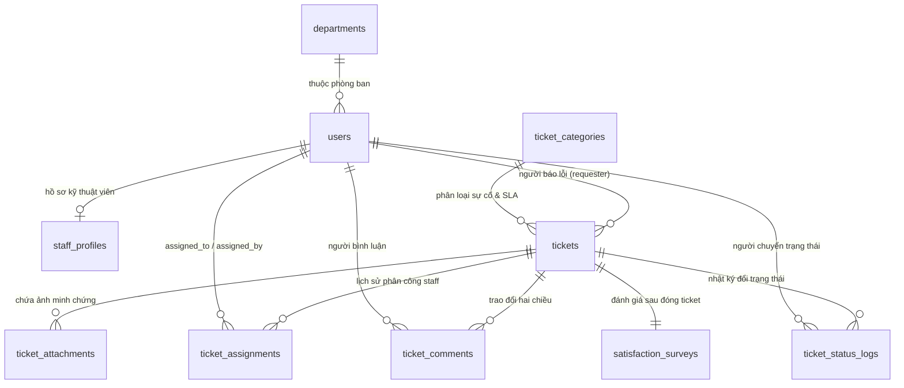

# 🗄️ THIẾT KẾ CƠ SỞ DỮ LIỆU MYSQL (DATABASE DATA MODEL)

Tài liệu này chi tiết hóa cấu trúc lưu trữ cơ sở dữ liệu quan hệ **MySQL / MariaDB** cho hệ thống **Helpdesk CNTT & Cơ sở vật chất (TLU)**. Kiến trúc được thiết kế tối ưu theo **Chuẩn hóa 3NF (Third Normal Form)**, đảm bảo tính toàn vẹn dữ liệu, hiệu năng truy vấn cao và hỗ trợ đầy đủ các ràng buộc khóa ngoại (Foreign Keys), chỉ mục (Indexes) và quy tắc bảo mật dữ liệu.

---

## 1. Sơ đồ Quan hệ Thực thể (ERD Schema Overview)



---

## 2. Chi tiết Đặc tả Các Bảng CSDL (Table Specifications - 10 Tables)

### 2.1. Bảng `departments` — Cơ cấu Tổ chức & Phòng ban
Chứa danh sách các Khoa, Phòng ban, Trung tâm trong toàn trường Đại học Thủy Lợi.

| Thuộc tính | Kiểu dữ liệu | Ràng buộc | Mô tả & Giải thích |
| :--- | :--- | :--- | :--- |
| `id` | `BIGINT` | `UNSIGNED, AUTO_INCREMENT, Primary Key` | ID phòng ban (Khóa chính) |
| `code` | `VARCHAR(20)` | `UNIQUE, NOT NULL` | Mã phòng ban (VD: CNTT, QT3B, DT) |
| `name` | `VARCHAR(100)` | `NOT NULL` | Tên phòng ban / đơn vị |
| `created_at` | `TIMESTAMP` | `NULLABLE` | Thời điểm tạo bản ghi |
| `updated_at` | `TIMESTAMP` | `NULLABLE` | Thời điểm cập nhật bản ghi |

### 2.2. Bảng `users` — Tài khoản Người dùng & Phân quyền
Lưu trữ toàn bộ thông tin tài khoản đăng nhập của Sinh viên, Giảng viên, Kỹ thuật viên và Quản trị viên.

| Thuộc tính | Kiểu dữ liệu | Ràng buộc | Mô tả & Giải thích |
| :--- | :--- | :--- | :--- |
| `id` | `BIGINT` | `UNSIGNED, AUTO_INCREMENT, Primary Key` | ID người dùng (Khóa chính) |
| `department_id` | `BIGINT` | `UNSIGNED, NULLABLE, Foreign Key` | Trực thuộc phòng ban nào (FK -> departments.id) |
| `name` | `VARCHAR(100)` | `NOT NULL` | Họ và tên đầy đủ |
| `email` | `VARCHAR(100)` | `UNIQUE, NOT NULL` | Email TLU (@st.tlu.edu.vn hoặc @tlu.edu.vn) |
| `password` | `VARCHAR(255)` | `NOT NULL` | Mật khẩu đã mã hóa (Bcrypt Hash) |
| `role` | `ENUM` | `'REQUESTER', 'STAFF', 'MANAGER'` | Vai trò hệ thống: Người gửi / Kỹ thuật / Quản lý |
| `created_at` | `TIMESTAMP` | `NULLABLE` | Thời điểm tạo tài khoản |
| `updated_at` | `TIMESTAMP` | `NULLABLE` | Thời điểm cập nhật |

### 2.3. Bảng `staff_profiles` — Hồ sơ Chuyên môn Kỹ thuật viên
Lưu thông tin nghiệp vụ mở rộng cho cán bộ kỹ thuật (Quan hệ 1-1 với users).

| Thuộc tính | Kiểu dữ liệu | Ràng buộc | Mô tả & Giải thích |
| :--- | :--- | :--- | :--- |
| `id` | `BIGINT` | `UNSIGNED, AUTO_INCREMENT, Primary Key` | ID hồ sơ (Khóa chính) |
| `user_id` | `BIGINT` | `UNSIGNED, UNIQUE, NOT NULL, Foreign Key` | Liên kết tài khoản (FK -> users.id, ON DELETE CASCADE) |
| `phone` | `VARCHAR(20)` | `NULLABLE` | Số điện thoại trực ca |
| `specialty` | `VARCHAR(100)` | `NULLABLE` | Chuyên môn chính (Mạng Wi-Fi, Máy chiếu, Phần mềm) |
| `shift` | `VARCHAR(50)` | `NULLABLE` | Ca trực cố định (Sáng / Chiều / Tối) |
| `created_at` | `TIMESTAMP` | `NULLABLE` | Thời điểm tạo |
| `updated_at` | `TIMESTAMP` | `NULLABLE` | Thời điểm cập nhật |

### 2.4. Bảng `ticket_categories` — Danh mục Sự cố & Cấu hình SLA
Danh mục loại lỗi kỹ thuật và thời gian cam kết khắc phục sự cố (SLA).

| Thuộc tính | Kiểu dữ liệu | Ràng buộc | Mô tả & Giải thích |
| :--- | :--- | :--- | :--- |
| `id` | `BIGINT` | `UNSIGNED, AUTO_INCREMENT, Primary Key` | ID danh mục (Khóa chính) |
| `name` | `VARCHAR(100)` | `UNIQUE, NOT NULL` | Tên loại sự cố (Lỗi Wi-Fi, Máy chiếu, Lỗi Kênh ĐKMH) |
| `description` | `TEXT` | `NULLABLE` | Mô tả chi tiết phạm vi sự cố |
| `sla_hours` | `INT` | `UNSIGNED, NOT NULL, DEFAULT 24` | Thời gian xử lý tối đa cam kết (Tính theo giờ) |
| `created_at` | `TIMESTAMP` | `NULLABLE` | Thời điểm tạo |
| `updated_at` | `TIMESTAMP` | `NULLABLE` | Thời điểm cập nhật |

### 2.5. Bảng `tickets` — Phiếu Phản ánh Sự cố (Central Table)
Bảng trung tâm chứa thông tin yêu cầu hỗ trợ sự cố từ Sinh viên/Giảng viên.

| Thuộc tính | Kiểu dữ liệu | Ràng buộc | Mô tả & Giải thích |
| :--- | :--- | :--- | :--- |
| `id` | `BIGINT` | `UNSIGNED, AUTO_INCREMENT, Primary Key` | ID phiếu sự cố (Khóa chính) |
| `title` | `VARCHAR(255)` | `NOT NULL` | Tiêu đề ngắn gọn mô tả sự cố |
| `description` | `TEXT` | `NOT NULL` | Mô tả chi tiết hiện trạng lỗi |
| `category_id` | `BIGINT` | `UNSIGNED, NOT NULL, Foreign Key` | Thuộc loại sự cố nào (FK -> ticket_categories.id) |
| `requester_id` | `BIGINT` | `UNSIGNED, NOT NULL, Foreign Key` | Người báo lỗi (FK -> users.id) |
| `status` | `ENUM` | `'OPEN', 'IN_PROGRESS', 'RESOLVED', 'CLOSED'` | Trạng thái phiếu: Mới / Đang xử lý / Đã xong / Đóng |
| `priority` | `ENUM` | `'LOW', 'MEDIUM', 'HIGH'` | Mức độ ưu tiên khắc phục |
| `created_at` | `TIMESTAMP` | `NOT NULL` | Thời điểm khởi tạo ticket |
| `updated_at` | `TIMESTAMP` | `NULLABLE` | Thời điểm cập nhật gần nhất |

### 2.6. Bảng `ticket_attachments` — Tệp & Hình ảnh Minh chứng
Lưu trữ danh sách nhiều ảnh đính kèm minh chứng sự cố lỗi của 1 Ticket.

| Thuộc tính | Kiểu dữ liệu | Ràng buộc | Mô tả & Giải thích |
| :--- | :--- | :--- | :--- |
| `id` | `BIGINT` | `UNSIGNED, AUTO_INCREMENT, Primary Key` | ID file đính kèm (Khóa chính) |
| `ticket_id` | `BIGINT` | `UNSIGNED, NOT NULL, Foreign Key` | Thuộc ticket nào (FK -> tickets.id, ON DELETE CASCADE) |
| `file_path` | `VARCHAR(255)` | `NOT NULL` | Đường dẫn lưu trữ ảnh trên Server Storage |
| `file_type` | `VARCHAR(50)` | `NULLABLE` | Định dạng file (image/jpeg, image/png, pdf) |
| `created_at` | `TIMESTAMP` | `NULLABLE` | Thời điểm tải file lên |

### 2.7. Bảng `ticket_assignments` — Lịch sử Phân công & Chuyển giao Kỹ thuật viên
Lưu vết lịch sử giao việc hoặc đổi Kỹ thuật viên phụ trách Ticket.

| Thuộc tính | Kiểu dữ liệu | Ràng buộc | Mô tả & Giải thích |
| :--- | :--- | :--- | :--- |
| `id` | `BIGINT` | `UNSIGNED, AUTO_INCREMENT, Primary Key` | ID lượt phân công (Khóa chính) |
| `ticket_id` | `BIGINT` | `UNSIGNED, NOT NULL, Foreign Key` | Phân công cho ticket nào (FK -> tickets.id) |
| `assigned_to_staff_id` | `BIGINT` | `UNSIGNED, NOT NULL, Foreign Key` | Kỹ thuật viên nhận nhiệm vụ (FK -> users.id) |
| `assigned_by_user_id` | `BIGINT` | `UNSIGNED, NOT NULL, Foreign Key` | Người thực hiện giao việc (FK -> users.id) |
| `note` | `TEXT` | `NULLABLE` | Ghi chú / Chỉ đạo chuyên môn khi giao việc |
| `assigned_at` | `TIMESTAMP` | `NOT NULL` | Thời điểm thực hiện phân công |

### 2.8. Bảng `ticket_comments` — Nội dung Trao đổi Hai chiều
Bình luận, trao đổi thông tin qua lại giữa Người báo lỗi và Kỹ thuật viên xử lý.

| Thuộc tính | Kiểu dữ liệu | Ràng buộc | Mô tả & Giải thích |
| :--- | :--- | :--- | :--- |
| `id` | `BIGINT` | `UNSIGNED, AUTO_INCREMENT, Primary Key` | ID bình luận (Khóa chính) |
| `ticket_id` | `BIGINT` | `UNSIGNED, NOT NULL, Foreign Key` | Thuộc ticket nào (FK -> tickets.id, ON DELETE CASCADE) |
| `user_id` | `BIGINT` | `UNSIGNED, NOT NULL, Foreign Key` | Người viết bình luận (FK -> users.id) |
| `content` | `TEXT` | `NOT NULL` | Nội dung câu trao đổi |
| `created_at` | `TIMESTAMP` | `NOT NULL` | Thời điểm gửi bình luận |

### 2.9. Bảng `ticket_status_logs` — Nhật ký Chuyển Trạng thái (Append-Only Log)
Lưu vết lịch sử thay đổi tiến độ của Ticket. Bảng này bất biến (chỉ INSERT, cấm UPDATE/DELETE).

| Thuộc tính | Kiểu dữ liệu | Ràng buộc | Mô tả & Giải thích |
| :--- | :--- | :--- | :--- |
| `id` | `BIGINT` | `UNSIGNED, AUTO_INCREMENT, Primary Key` | ID log (Khóa chính) |
| `ticket_id` | `BIGINT` | `UNSIGNED, NOT NULL, Foreign Key` | Thuộc ticket nào (FK -> tickets.id) |
| `changed_by_user_id` | `BIGINT` | `UNSIGNED, NOT NULL, Foreign Key` | Người bấm chuyển trạng thái (FK -> users.id) |
| `old_status` | `VARCHAR(20)` | `NULLABLE` | Trạng thái trước khi chuyển |
| `new_status` | `VARCHAR(20)` | `NOT NULL` | Trạng thái mới chuyển sang |
| `created_at` | `TIMESTAMP` | `NOT NULL` | Thời điểm ghi nhận thao tác |

### 2.10. Bảng `satisfaction_surveys` — Khảo sát Đánh giá Mức độ Hài lòng
Bài đánh giá chất lượng phục vụ sau khi Ticket đã hoàn thành xử lý.

| Thuộc tính | Kiểu dữ liệu | Ràng buộc | Mô tả & Giải thích |
| :--- | :--- | :--- | :--- |
| `id` | `BIGINT` | `UNSIGNED, AUTO_INCREMENT, Primary Key` | ID bài đánh giá (Khóa chính) |
| `ticket_id` | `BIGINT` | `UNSIGNED, UNIQUE, NOT NULL, Foreign Key` | Khóa ngoại duy nhất (FK -> tickets.id, UNIQUE) |
| `rating_stars` | `TINYINT` | `NOT NULL, CHECK (rating_stars BETWEEN 1 AND 5)` | Mức điểm chấm: 1 đến 5 sao |
| `comment` | `TEXT` | `NULLABLE` | Ý kiến nhận xét đóng góp |
| `created_at` | `TIMESTAMP` | `NOT NULL` | Thời điểm gửi đánh giá |

---

## 3. Ràng buộc Toàn vẹn & Quy tắc Bảo mật CSDL (Database Constraints & Security)

```sql
-- 1. Ràng buộc Khóa ngoại & Xóa an toàn (Foreign Key Constraints)
ALTER TABLE `users` 
  ADD CONSTRAINT `fk_users_department` 
  FOREIGN KEY (`department_id`) REFERENCES `departments`(`id`) ON DELETE SET NULL;

ALTER TABLE `tickets` 
  ADD CONSTRAINT `fk_tickets_category` 
  FOREIGN KEY (`category_id`) REFERENCES `ticket_categories`(`id`) ON DELETE RESTRICT,
  ADD CONSTRAINT `fk_tickets_requester` 
  FOREIGN KEY (`requester_id`) REFERENCES `users`(`id`) ON DELETE CASCADE;

ALTER TABLE `ticket_attachments` 
  ADD CONSTRAINT `fk_attachments_ticket` 
  FOREIGN KEY (`ticket_id`) REFERENCES `tickets`(`id`) ON DELETE CASCADE;

ALTER TABLE `satisfaction_surveys` 
  ADD CONSTRAINT `fk_surveys_ticket` 
  FOREIGN KEY (`ticket_id`) REFERENCES `tickets`(`id`) ON DELETE CASCADE;

-- 2. Ràng buộc điểm đánh giá sao từ 1 đến 5 (Check Constraint)
ALTER TABLE `satisfaction_surveys` 
  ADD CONSTRAINT `chk_rating_stars` CHECK (`rating_stars` >= 1 AND `rating_stars` <= 5);
```
